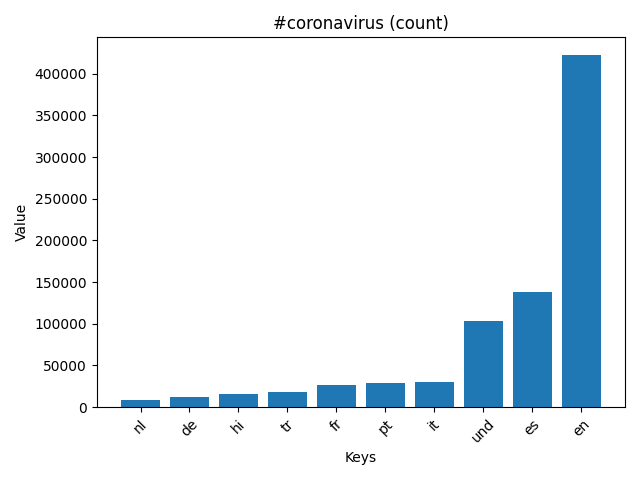
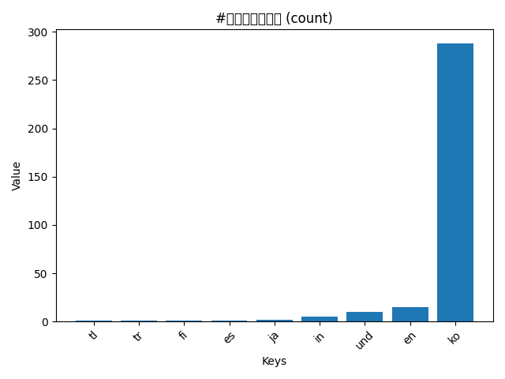
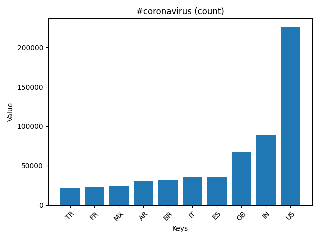
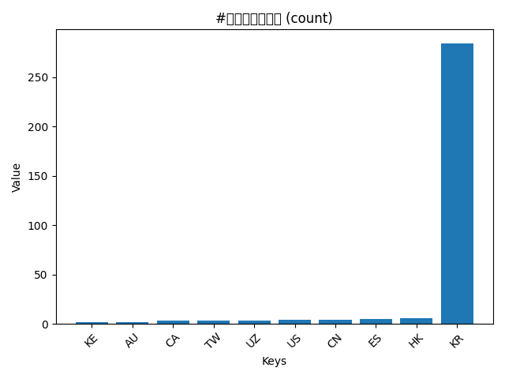
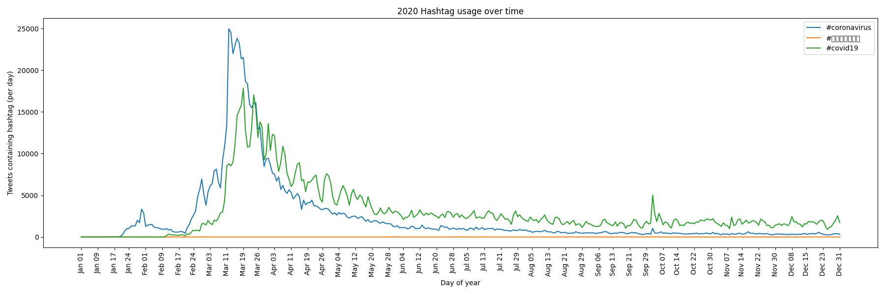

# COVID-19 Twitter Hashtag Analysis

This project processes a large corpus of geotagged tweets from 2020 to track how public conversation around the coronavirus evolved over time. Using daily tweet files containing millions of tweets (~2 TB of data), I developed a MapReduce-style shell and python pipeline that:
* Extracts language and country usage counts for specific hashtags per day.
* Aggregates daily counts across all languages or countries.
* Visualizes trends in tweet volume for chosen hashtags.

The primary goal was to measure the temporal spread and volume of COVID-19 related discussion on Twitter. This project would be useful for deriving insights relevant to social media analytics, public discourse tracking, and epidemiology research.

## What the Scripts Do:
* map2.py: For each day’s geotagged tweets, count how often selected hashtags appear across languages.
* reduce.py: Combine these daily outputs into cumulative counts for each hashtag.
* visualize.py: Create graphs using matplotlib to visualize the cumulative counts from reduce.py.
* alternative_reduce.py: A combination of reduce.py and visualize.py. Input hashtags related to covid-19, combine the aggregate data from the year, and then visualize over each day of the year how often the chosen hashtags were utilized.

All core logic is implemented in Python, with outputs saved as .png charts.
## Generated Visualizations
Four distinct plots are produced, each providing insight into how Twitter users discussed the pandemic:
Language Distribution Bar Graphs
Bar charts showing the top languages tweeting each selected COVID-19 hashtag.

Country Distribution Bar Graphs
Bar charts e.g., showing which countries tweeted the most about specific hashtags.

Daily Usage Time Series (per hashtag)
Line plots that track hashtag frequency over the entire year with 48 evenly spaced date ticks.

Each visualization captures a different dimension of how conversation about COVID-19 spread across space (languages, countries) and time.

## Why This Matters
This project demonstrates:
* Ability to work with large, real-world datasets (~1.1B tweets).
* Practical application of parallel data processing (MapReduce).
* Skill in data aggregation and visualization for insight extraction.

